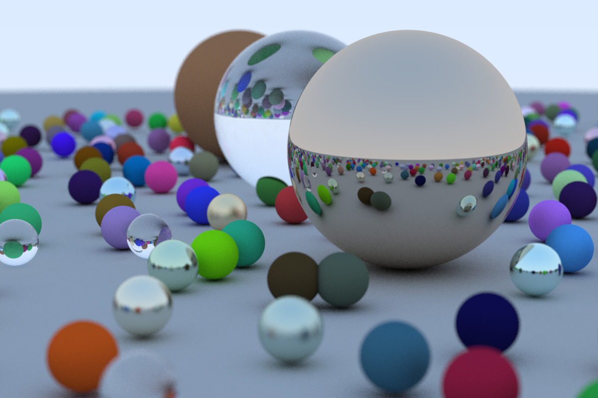

# Raytracing in One Weekend
A simple Raytracer based on the book "Ray Tracing in One Weekend" ([link](https://github.com/petershirley/raytracinginoneweekend)) written in Rust



## Build
Minimal Rust Version 1.31 (`edition = "2018"`)
1. Install Rust ([rustup.rs](https://rustup.rs))
2. Clone the repository
3. Build `cargo build --release`

## Usage
```bash
./target/release/raytracer-in-one-week
```

## License
Unlicense